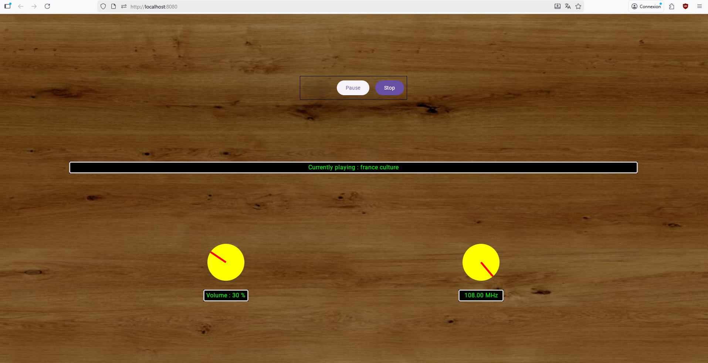

Un projet Kotlin Multiplatform pour émuler le comportement d'une radio vintage sur différents supports (Desktop, Web & Android(Todo)).

Interface actuelle :

La version desktop necéssite d'installer [VLC](https://www.videolan.org/vlc/).

Fonctionnalitées / interface incluant  :

- Deux boutons à tourner pour gérer la fréquence et le volume.
- Une dizaine de stations différentes accessibles en changeant de fréquence.
- Bruits blancs entre les stations, avec modulation de l'intensité sonore en fonction de la différence de fréquence
- Accrochage à la station la plus proche en relachant le bouton de fréquence.
- Boutons d'interaction play / pause / stop
- Chargement de la dernière station jouée au démarrage de l'application
  

Code :
- Interface graphique commune au différentes plateformes
- Composants réutilisables : bouton tournant et affichage texte
- ViewModel de radio commun à toutes plateformes
- Prise en charge de la partie son ainsi que sauvegarde d'information (dernière station jouée) spécifique à chaque plateforme

Reste à faire :
- Implémentation Androide
- Travail sur l'interface graphique

Évolutions possibles :
- Utilisation d'une API pour récupérer les différentes stations
- Avec intégration de métadatas si disponibles (musique en cours, durée...)
- Stations favorites avec boutons de sauvegarde de fréquences

- Inclusion d'une partie lecture de musique
